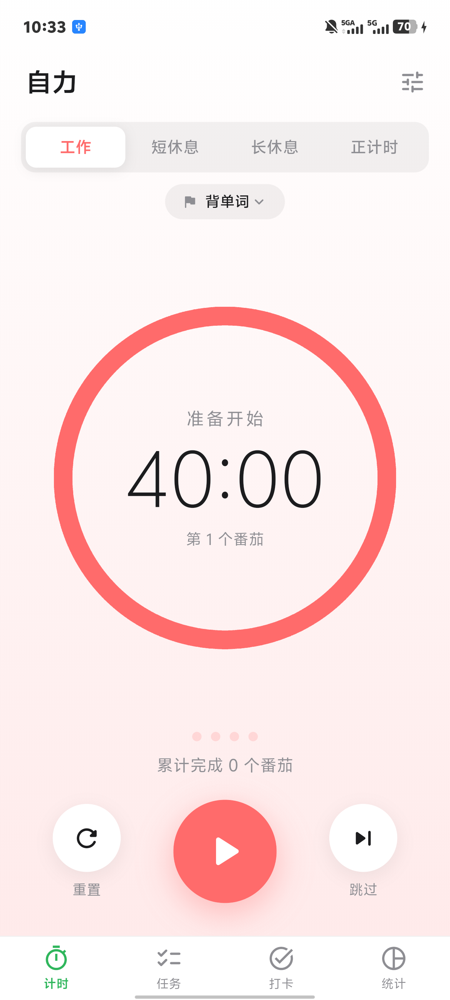
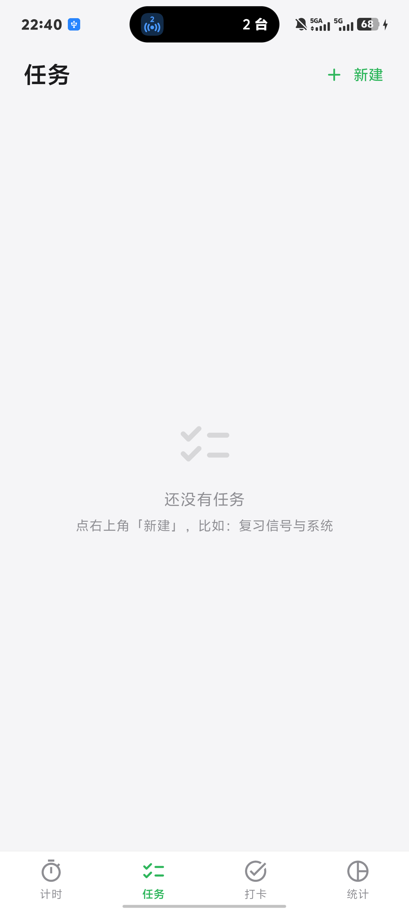
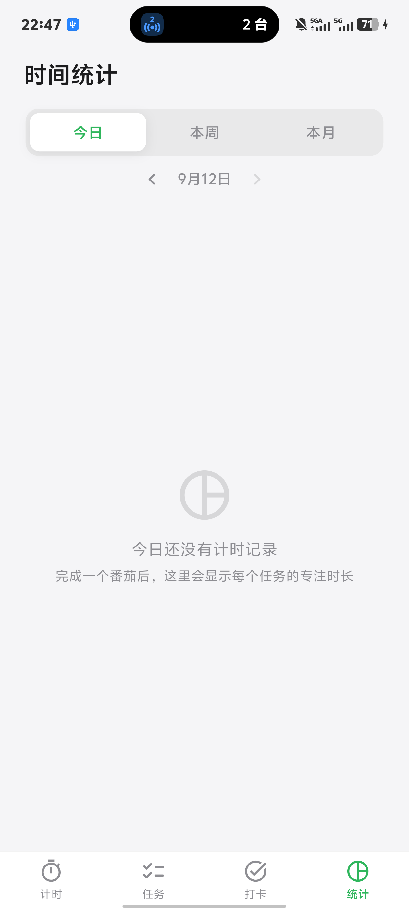

# 🌱 自力 · 自律番茄钟（Zili Pomodoro）

[](LICENSE)

一款使用 **Flutter** 开发的 Android「自律向」番茄钟应用：不只是计时器，还有**任务管理、自律打卡、专注时长统计（日 / 周 / 月）**，全部数据保存在本地。UI 遵循 Apple 设计语言，代码含详细中文注释。

<p align="left">
  
  
  
</p>

<p align="left">
  
</p>

---

## ✨ 功能特性

### ⏱ 计时
- 三种模式：工作（默认 25 分钟）/ 短休息（5 分钟）/ 长休息（15 分钟），时长均可自定义
- **正计时（自由计时）**：不知道要工作多久？不限时长正着数，随时结束，按实际用时入账
- 大号数字 + 圆形进度环展示剩余时间比例（正计时时圆环走满 = 专注 1 小时）
- 开始 / 暂停 / 重置 / 跳过；暂停恢复不丢秒，时间永不为负
- 每 4 个番茄自动切换到长休息

### 📋 任务管理
- 新建任意数量的任务，每个任务**独立设置**名称 + 工作 / 短休 / 长休三个时长
- 点任务卡片即可启用并跳转计时，**沿用该任务已设好的番茄钟参数**
- 计时页顶部任务胶囊显示当前任务，可随时切换

### ✅ 自律打卡
- 自定义每日打卡项（如：早起 7 点 / 跑步 3 公里 / 背单词）
- 每日打勾，显示**连续打卡天数**与**最近 7 天记录**
- 打卡历史按天保存在本地

### 📊 专注统计
- **扇形图**按任务展示专注时长占比，图下标注每个任务的具体时长与百分比
- **今日 / 本周 / 本月** 三种周期切换；`◀ ▶` 可回看历史周期
- 统计**按天存档**在本地（`{任务: {日期: 秒数}}`），历史永久保留
- 时长记账精确到**实际用时**：完成 / 重置 / 跳过一律按秒表真实累计入账（休息时段不计入）

### 🔔 提醒 & 后台
- 到点提醒：前台震动（三段式）+ 内置提示音；后台由**系统通知**提醒（铃声 + 震动）
- **后台计时**：基于「绝对时间戳 + 精确闹钟（AlarmManager）」，锁屏 / 后台 / 进程被系统回收都能准时提醒
- 本地持久化：任务、打卡、统计、计时节拍全部存本地，重启不丢

### 🍎 UI
- 设计语言：分段控件、柔和渐变、圆角卡片、大号细体数字、
- 底部导航四个模块（计时 / 任务 / 打卡 / 统计）自由切换，切换时计时不中断
- 全新绿色简约 App 图标（脚本生成：绿渐变 + 白色圆环对勾）

## ⬇️ 下载安装

**APK 下载**（推荐 Releases）：

- 最新版本：<https://github.com/7iyxx/zili-pomodoro/releases/latest>
- 直链：<https://github.com/7iyxx/zili-pomodoro/releases/latest/download/zili-v1.3.0.apk>

**安装步骤**

1. 用手机打开上面的链接下载 APK
2. 点击安装（首次需允许「安装未知应用」）
3. 首次启动请允许**通知权限**（Android 13+ 会弹窗询问）
4. 建议在系统设置中把本应用的电池策略设为**「无限制」**（部分国产 ROM 后台管控较激进），并且不要在"最近任务"里强行划掉应用，以免取消已排定的后台提醒

> 支持 Android 7.0（API 24）及以上。

## 🛠 从源码构建

**环境要求**

- Flutter **3.38.1+**（开发使用 3.47.4 stable）
- Android SDK（compileSdk 36 / build-tools 36）+ **NDK 28.2.13676358**
- JDK 17+（Android Studio 自带的 JBR 即可）

**构建命令**

```bash
git clone https://github.com/7iyxx/zili-pomodoro.git
cd zili-pomodoro
flutter pub get
flutter build apk --release
# 产物：build/app/outputs/flutter-apk/app-release.apk
```

> 工程内已配好 flutter_local_notifications 所需的 **core library desugaring**、精确闹钟权限与通知接收器（AndroidManifest 已改）。
> 详细的从零环境搭建、常见报错与踩坑记录见 [docs/build-guide.md](docs/build-guide.md)。

## 🧱 技术栈

| 依赖 | 版本 | 用途 |
|---|---|---|
| Flutter / Dart | 3.47.4 / 3.10 | 开发框架 |
| flutter_local_notifications | ^22 | 后台到点通知（精确闹钟调度） |
| timezone | ^0.11 | 通知调度的时区支持 |
| shared_preferences | ^2.5 | 本地持久化（任务 / 打卡 / 按天统计） |
| audioplayers | ^6.8 | 前台提示音（内置自制 ding.wav） |
| vibration | ^3.2 | 到点震动 |

## 📂 项目结构

```
zili-pomodoro/
├── lib/
│   └── main.dart              # 全部应用代码（单文件，9 大区块，全中文注释）
├── assets/
│   └── sounds/ding.wav        # 计时结束提示音（由脚本生成，无版权素材）
├── android/                   # 已配好：权限 / 通知接收器 / desugaring / 新图标
├── scripts/
│   ├── gen_icon.py            # App 图标生成脚本（绿渐变 + 白圆环对勾）
│   └── gen_chime.py           # 提示音生成脚本
├── screenshots/               # 应用截图
└── docs/
    └── build-guide.md         # 完整打包教程 & 踩坑记录
```

## 🔍 实现要点

**后台计时的三层机制**：

1. 计时基于「结束时间戳」推进，与界面是否可见无关 —— 回前台 / 重启后永远算得对；
2. 退到后台时向系统注册**精确闹钟 + 本地通知**，到点由系统提醒，进程被杀也不丢；
3. 回前台自动撤销待发通知并校验是否已到点（静默补结算），既不重复提醒也不漏提醒。

**本地数据模型**：任务列表、打卡项 / 记录、专注统计均以 JSON 存于 SharedPreferences；统计采用**按天存档**（`{任务ID: {yyyy-MM-dd: 秒数}}`），日 / 周 / 月统计与历史回看都从这份明细聚合，旧版本数据会自动迁移。

## ❓ 常见问题

| 问题 | 解决 |
|---|---|
| 后台到点不提醒 | 检查通知权限与勿扰模式；把电池策略设为「无限制」；不要强杀应用 |
| 首次构建很慢 | 需要下载 Gradle 与依赖，属正常现象；工程已把 Gradle 发行包指向腾讯镜像 |
| 构建报 desugaring / JDK 相关错误 | 见 [docs/build-guide.md](docs/build-guide.md) |
| 想换图标配色 | 修改 `scripts/gen_icon.py` 里的绿色值后重新运行脚本 |

## 📝 更新日志

- **v1.3.0** — 新增「正计时」（自由计时）；统计记账改为**秒表式精确累计**，修复中途跳过导致统计时长虚高的问题
- **v1.2.0** — 统计支持按天存档与日 / 周 / 月历史聚合
- **v1.1.0** — 新增任务管理、自律打卡、专注统计三大模块
- **v1.0.0** — 首个版本：三种计时模式 / 圆形进度环 / 番茄计数 / 后台提醒

## 📄 License

本项目基于 [MIT License](LICENSE) 开源 —— 你可以自由使用、修改、分发（只需保留版权声明）。

图标与提示音均由仓库内脚本生成，无版权素材。
